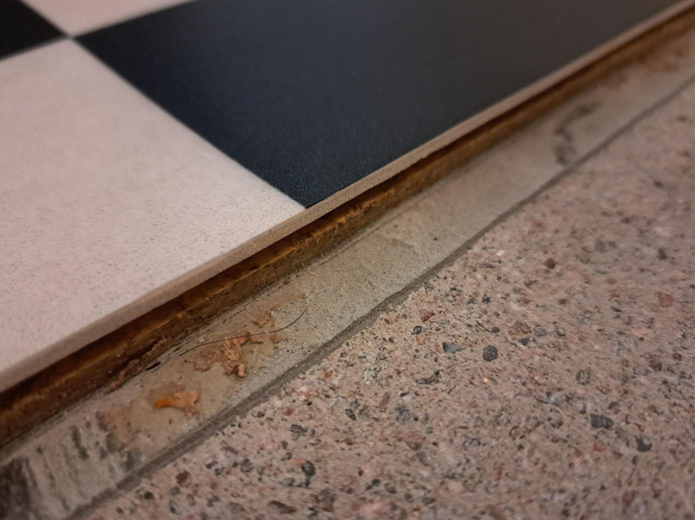

# floor-renovation

I had a small water damage in the kitchen. The maintenance company removed a small part
of the floor and dried it with machine for a week.

I decided to redo the floor myself. Below are some notes about the process. This is
my first time building a floor so mistakes were inevitably made. I'll highlight
the mistakes I made and some other important aspects during the process.

## Floor structure

There are four layers visible in this picture:
1. Top layer: soft plastic
2. Cork underlayment
3. Levelling compound
4. Concrete subfloor

The cork underlayment is glued to the levelling compound (visible in the picture), which is a major source
of pain in the subsequent process. Our plan is to:
1. Remove the top layer and the cork underlayment (since the damaged area already has
these two layers removed)
2. Level the ground
3. Lay vinyl plank flooring

## Asbestos check

The house was built in the early 80s and there is a small probability that materials containing
asbestos were used, e.g. in the glue. I thought it was a must to get this checked.

## Isolate the work area

It was anticipated that dust will be generated during the process, so it was a good
idea to isolate the work area.

## Remove the skirting board

A pry bar might be useful here.

After the skirting board is removed

## Rip away the existing floor

The existing floor is made from soft plastic and is easy to rip away.

After that, the cork underlayment is exposed.

## Remove the cork underlayment

This is without a doubt the most difficult and challenging step, because the cork
underlayment is glued to the levelling compound. I tried different methods, for example,
with a dedicated manual tool like this:

But it did not work as expected. The best way to remove the cork layer is using a hammer drill
paired with a chisel bit that is flat on one side.

It's best to apply some downward force so that the glue is removed as well, exposing the
levelling compound.

  

The process is labour-intensive:

And the result is messy:

## Remove the residue glue

There are different ways to remove the residue glue. The easiest way is to rent a floor
grinder:

Here comes my first mistake: it is absolutely recommended to also rent a dust extractor
to be used together with the floor grinder, otherwise, it gets very very dusty!

The result after grinding:

Now we can start levelling the ground.

## Prime the surface

Before levelling the ground, we must prime the surface so that the new self-levelling compound
adheres to the existing surface.

The surface must be very clean. The primer is mixed with water in `1:3` ratio and applied to the
surface with a brush:

Allow it to dry for two to four hours. After priming, the surface looks glossy.

## Define the perimeter of the levelling area

The self-levelling compound is very liquidy and it is necessary to completely seal the
boundary of the levelling area so that it does not flow e.g. under the existing cupboard.

The expansion foam (insulation foam) was used to seal the boundary:

## Mix the self-levelling compound

After calculation, it was deemed that two bags of self-levelling compound were
needed. The self-levelling compound dries quite fast so I mixed two bags beforehand:

You should definitely use a power tool to do the mixing. Be aware that your
power tool should have enough power for the amount of material being mixed. The mixing paddle
I bought was too large for my drill so I had to use a dedicated mixer

It is crucial to use the correct amount of water instructed on the package. The eventual
consistency should resemble that of pea soup. You should scoop the corners of the bucket
to make sure there are no lumps.

## Levelling the floor

Pour the levelling compound evenly and use a trowel to spread it evenly.

When the area is large, you might have to walk on the compound so some rubber boots
can be helpful. Now, it is highly recommended to use a spiked roller to "activate"
the surface. It removes trapped air bubbles and creates a smooth finish.

It dries overnight and we can start laying the floor after one day.

Use a spirit level to check for flatness. For a large area, get the longest one you can find.

Some small imperfections, which we simply let go:

