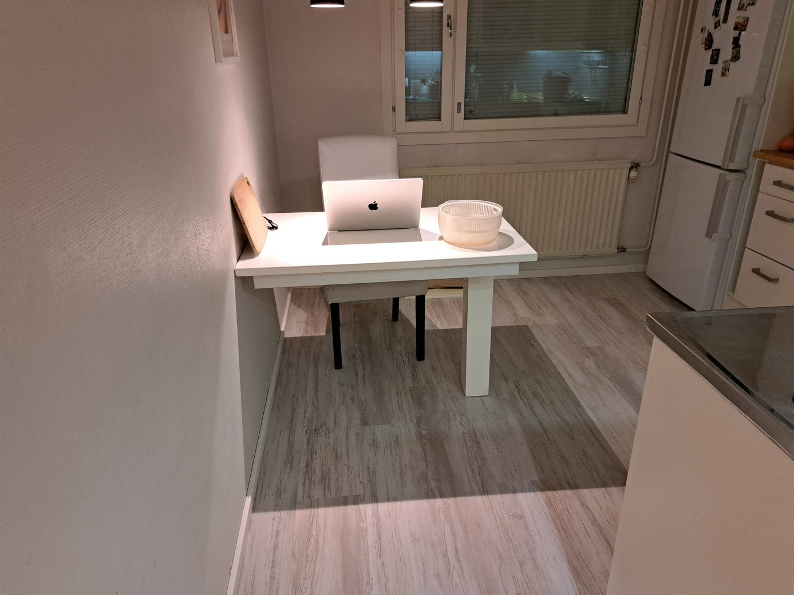

# floor-renovation

I had a small water damage in the kitchen. The maintenance company removed a
small part of the floor and dried it with machine for a week.

I decided to redo the floor myself. Below are some notes about the process.
This is my first time building a floor so mistakes were inevitably made. I'll
highlight the mistakes I made and some other important aspects during the
process.

## Floor structure

There are four visible layers in this picture:
1. Top layer: soft plastic
2. Cork underlayment
3. Levelling compound
4. Concrete subfloor

The cork underlayment is glued to the levelling compound, which is a major
source of pain in the subsequent process. Our plan is to:
1. Remove the top layer and the cork underlayment (since the damaged area
   already has these two layers removed)
2. Level the ground with new levelling compound
3. Lay vinyl plank flooring and install new skirting board

## Asbestos check

The house was built in the early 80s and there is a small probability that
asbestos were used in some of the building materials, e.g. the glue. I thought
it was a must to get this checked.

## Isolate the work area

It was anticipated that dust will be generated during the process, so it was a
good idea to isolate the work area.

 

## Remove the skirting board

A pry bar might be useful here.

After the skirting board is removed

## Rip away the existing floor

The existing floor is made from soft plastic and is easy to rip away.

After that, the cork underlayment is exposed.

## Remove the cork underlayment

This is without a doubt the most difficult and challenging step, because the
cork underlayment is glued to the levelling compound. I tried different
methods, for example, with a dedicated manual tool like this:

But it did not work as expected. The best way to remove the cork layer is using
a hammer drill paired with a chisel bit that is flat on one side.

 

It's best to apply some downward force so that the glue is removed as well,
exposing the levelling compound.

  

The process is labour-intensive:

And the result is messy:

 

## Remove the residue glue

There are different ways to remove the residue glue. The easiest way is to rent
a floor grinder:

Here comes my first mistake: it is absolutely recommended to also rent a dust
extractor to be used together with the floor grinder, otherwise, it gets very
very dusty!

The result after grinding:

Now we can start levelling the ground.

## Prime the surface

Before levelling the ground, we must prime the surface so that the new
self-levelling compound adheres to the existing surface.

The surface must be very clean. The primer is mixed with water in `1:3` ratio
and applied to the surface with a brush:

Allow it to dry for two to four hours. After priming, the surface looks glossy.

## Define the perimeter of the levelled area

The self-levelling compound is very liquidy and it is necessary to completely
seal the boundary of the levelled area so that it does not flow e.g. under the
existing cupboard.

The expansion foam (insulation foam) was used to seal the boundary:

 

## Mix the self-levelling compound

After calculation, it was deemed that 40 kg (two bags) of self-levelling
compound were needed. This was the second mistake. In fact, 60 kg would have
been better. This is because when the levelling compound is spread too thin in
some areas (approaching the 3mm lower limit stated on the package), it might
create eventual unevenness.

The self-levelling compound dries quite fast so I mixed two bags beforehand:

 

You should definitely use a power tool to do the mixing. Be aware that your
power tool should have enough power for the amount of material being mixed. The
mixing paddle I bought was too large for my drill (mistake #3) so I had to get
a dedicated mixer:

It is crucial to use the correct amount of water instructed on the package. The
eventual consistency should resemble that of pea soup. You should scoop the
corners of the bucket to make sure there are no lumps.

## Levelling the floor

Pour the levelling compound evenly and use a large trowel to spread it evenly.
I didn't pour it evenly, so there were some eventually unflatness (mistake #4).

When the area is large, you might have to walk on the compound so some rubber
boots can be helpful. I didn't, so it got messy (mistake #5). Now, it is highly
recommended to use a spiked roller to "activate" the surface. It removes
trapped air bubbles and creates a smooth finish. It also helps even out the
levelling compound. You should attach the roller to a long stick so that you
can roll over large areas without squatting. I didn't do so, which also
contributed to the eventual unflatness (mistake #6).

 

The levelling compound dries overnight and we can start laying the floor after
24 hours.

Use a spirit level to check for flatness. For a large area, get the longest one
you can find. I forgot to take a picture of this step so here is a stock photo:

Some small imperfections, which we simply let go:

I remedied some measured unflatness with a thin and soft underlayment material
which can be seen in later pictures (blue sheets under the vapor barrier).

## Add the vapor barrier

Before laying the vinyl planks, we must add a layer of vapor barrier.

Two sheets should have an overlap of about 40cm and then sealed with vapor
barrier tape.

## Before laying the vinyl planks

A dedicated vinyl cutter is highly recommended.

Before laying the vinyl planks, measure the area accurately, and do some
planning. The manufacturer usually provides a recommendation for the minimum
distance between the seams of two adjacent rows, so you should follow that.

Remember that when you finish one row, you can often use the leftover piece to
start another row. However, never start or end a row with a very short piece. I
made sure that all my pieces were at least 40cm long.

You might need to trim the door jamb to accomodate the new floor. This can be done
with an oscillating multitool and a saw blade.

## Laying the vinyl planks

Finally, we can start laying the vinyl planks. These are from Parador and made
in Germany, costing roughly 40 EUR per square meter, which is on the expensive
end. But the kitchen is small so the total cost is ok. They come with
underlayment already attached on the back side, so no additional underlayment
is needed.

I started by installing a piece on a location that requires a special cut (done with
a multitool).

Then start from this row and extend it to the wall (normally you want to start
from the wall so mine is a special case). We lay the planks in the direction of
sunlight.

Spacer are inserted along the wall to leave an expansion gap for the floor
under temperature variations.

Use a mallet and a dedicated tapping block. The edge of the vinyl planks are delicate
so one mustn't use excessive force. Basically, "tap tap" instead of "knock knock".

Use a pull bar to tap on the edge

Almost done!

## Install new skirting board

The Parador skirting board comes with mounting clips. These should be nailed to
the wall but I simply glued them with a glue gun.

Then clip on the skirting board:

## Finished floor

